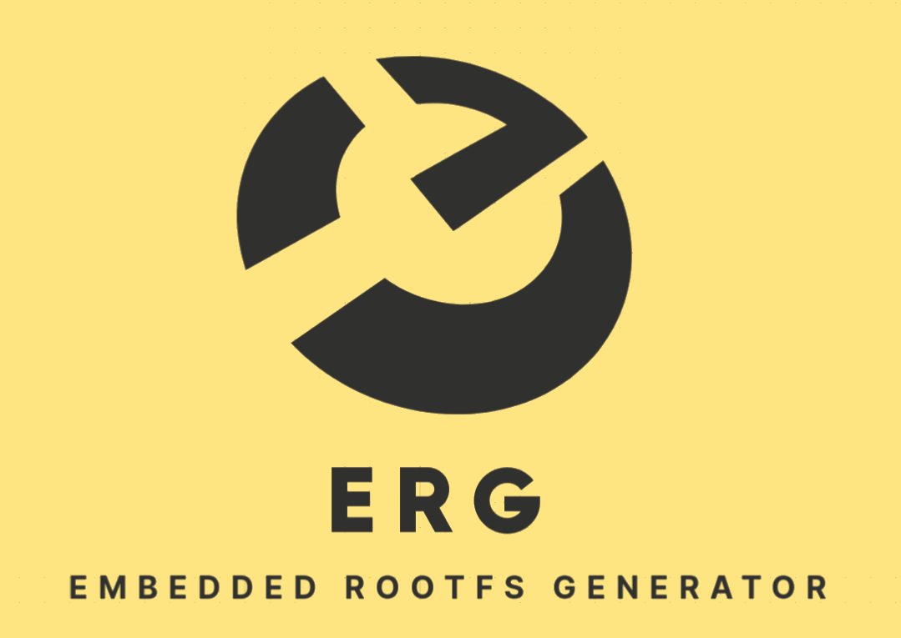

# ERG - Embedded Rootfs Generator

ERG is provided under the terms of the GNU General Public License v2.0 or later,
as provided in [LICENSE.md](LICENSE.md).

Copyright (C) KERNELSPACE 2021 - Angelo Dureghello

##### Table of Contents  
- [Introduction](#introduction)
- [Quick start](#quick-start)
  - [Create a board configuration](#create-a-board-configuration)
  - [Setup build variables](#setup-build-variables)
  - [Create package list](#create-package-list)
- [Build](#build)
- [Credits](#credits)

## Introduction

erg (all minor) is a simple rootfs (distribution, if you like it) generator,
as it means a"embedded rootfs generator". Actually, the cross-toolchain creation
is delegated to the user, very good tools as ct-ng, or openadk are available,
due to the fact that building a proper toolchain for the target is an extremly
long process, and complex too, and is actually not in the aim of this small
rootfs generator.

## Quick start

### Create a board configuration

Create a configuraiton file "boards/yourboard", or check/duplicate the
boards/example configuration.

### Setup build variables

In the board config file, setup at least:

  erg_cross
  target_host
  arch

Optional:

Generate initramfs

  export initramfs=1

For other available variables please check boards/example.

### Create package list

Check/copy some existing package list in /pkg-list directory.
Note, available packages are visible in the sources directory. Missing
packages should be created frin time to time,

### Build
``` Bash
./go.sh yourboard
```
### Build a specific package
``` Bash
./go.sh yourboard pkg
```
## Credits

This small generator is copyright (C) of Angelo Dureghello, KERNELSPACE.
Feel free to provide any feedback to angelo AT kernel-space.org.

